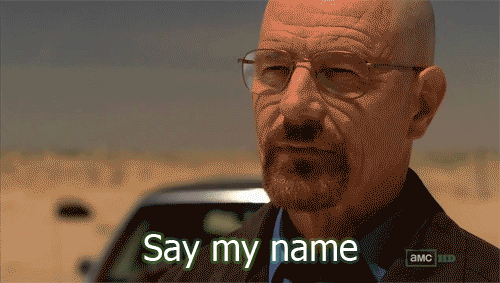

<div dir="rtl">
  
# جلسه سوم: عملگرها، شرط، حلقه، تابع
  
  
  ## تمرین
  
  <div dir="rtl">
  
  1. تمامی تمرین‌های جلسه دوم به جز سوال‌های 9 و 10 کدنویسی شود.

  [تمرین‌های جلسه دوم](../session02/README.md)
  
  2. تابعی بنویسید که N .نظر از کاربر دریافت کند و با روش زیر مشخص کنند چه تعداد طرفدار سریال هستند
  
  - اگر داخل متن عبارت 'House Of The Dragon' بود یک واحد به متغیر نظرهای مرتبط با  آن سریال اضافه شود.
  - اگر داخل متن عبارت 'The Rings Of Power' بود، یک واحد به متغیر  نظرهای مرتبط با  آن سریال اضافه شود.
  - در نهایت تعداد نظرهای هرکدام از سریال‌ها چاپ شود.

  (راهنمایی: از عملگر عضویت استفاده کنید)

  نمونه نظرها:
  
 </div>
 </div>

  ```
  N=5

  1. This slow-burn episode of House Of The Dragon is Game Of Thrones as we know it – for better or worse.

  2. In The Lord of the Rings: The Two Towers, we are told that male and female dwarves are indistinguishable from one another due to their heavy facial hair. Well, a female dwarf appears in The Rings of Power – Sophia Nomvete’s Princess Disa – and she only has minimal facial hair. It’s very easy to distinguish her from the male dwarves.

  3. The episode’s title, "Second Of His Name,"”" refers to the fact that baby Aegon shares a name with Aegon the Conqueror, the legendary warrior who united the Seven Kingdoms under Targaryen rule. Considering most of House Of The Dragon's power players assume young Aegon will supplant his big sister as heir, the name is a portentous one.

  4. Matt Smith plays Daemon as a vain and bitter man who nevertheless cannot quite betray his family name. He is a nasty piece of work, for sure, a misogynist and a sadist, but until episode six, he is the only truly despicable main player in King’s Landing. House of the Dragon takes its time to drip-feed the down-in-the-dirt baddies that are so enjoyable to rail against.

  5. whereas fewer people are complaining about House of the Dragon’s adaptation of George RR Martin’s Fire and Blood. Still, Rings of Power has broken every Amazon viewership record there is, so it’s doing what it needs to do for them.

  ```

<div dir="rtl">
  3. تابعی بنویسید که یک نام بگیرد و عبارت "سلام {نام}" را چاپ کند.
  
  

  ## تمرین های پیشرفته:
  1. تابعی بنویسید که تعداد N عدد از ورودی خوانده و مجموع آنها را محاسبه و چاپ کند
  2. تابعی بنویسید که تعداد N عدد صحیح مثبت را خوانده و از بین آنها تعداد اعدادی که بر 5 بخشپذیر هستند را مشخص نماید.
  3. تابعی بنویسید که یک عدد از ورودی بخواند و مقسوم علیه های آن را چاپ کند(مقسوم علیه، اعداد کوچکتر بخشپذیر بر آن عدد).
  4. تابعی بنویسید که دو رشته به عنوان آرگومان بگیرد و چک کند که رشته اولی داخل رشته دومی موجود است یا نه.
  5. تابعی بنویسید که یک آرگومان mode بگیرد. وظیفه تابع ورودی گرفتن از کار است. اگر mode برابر s بود، همان رشته ورودی خروجی داده شود. در صورتی که i بود، رشته تبدیل به عدد صحیح شده و سپس به خروجی داده شود. 


  ## نحوه ارسال
تمامی تمرین‌ها در قالب یک فایل  py که نام آن، نام خانوادگی شما است، به صورت تابع‌های پشت سر هم نوشته شده و با فاصله جدا شده باشند. تمرین‌های پیشرفته اختیاری است. همچنین دانش‌پذیران مهلت دارند تمرینات هر هفته را تا آخر روز سه‌شنبه هفته آتی ارسال نمایند.

  نمونه فایل ارسالی:
  </div>

  ```python
  # excercise 1:
  def exercise1():
    ...

  # exercise 2:
  def exercise2():
    ...
  

  ```
